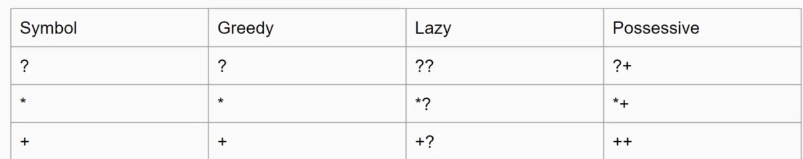

# What is regex? 
A special text string that describes a search pattern
# Basic
- Literal characters : looking for exact match. eg if my pattern is "ab" that means I am looking for ab. If mode/flag is global that means it will return all "ab" else it will return the first one.
- Meta characters : `( ) [ ] { { \ ^ $ | ? * + . < > - = !`  - These characters have special meaning in regex query hence can not be used as is. We need to convert them to literal by adding backslash(`\`) before the character. For example if I am looking for all dots(`.`) in a text, the regex query will be `\.`. Here is the description of these special meanings - 
    - TODO
    - `.` matches any character except enter/line break/new line/ null terminator
- Special characters:
    - There are special shorthand characters
        - `\d` - matches any character that is a digit(0-9), in character set(`[]`) + character range(`-`) (comming next) terms it will be `[0-9]`
        - `\D` - matches any character that i *NOT* a digit(0-9)
        - `\w` - any word character(alphanumeric,underscore) / low ascii character(no accented or non roman) <=127-ascii code
        - `\W` - opposite of `\w`
        - `\s` - any whitespace
        - `\S` - opposite of `\s`
- Non printable character
    - `\t` - tab
    - `\n` - new line
    - `\v` - vertical tab
    - `\r` - carriage return (`\r\n` on windows is equivalent to `\n` in linux -> both cases cursor goes to the next line first character)
    - `\f` -  form feed
# Character set
- Symbol `[]` - represents character set. Let's assume we have a text where we surely know that there is a person name Sam, Mam, Xam or Tam. So, `am` is common here and first character can be either 'S'(from Sam), or 'M'(from Mam) , or 'X'(from Xam) or 'T'(from Tam). We can use a dot('.') to match the first character but that would be too wide since it will also match @am! Here comes the character set handy - [SMXT]am is the perfect regex that matches either Sam or Mam or Xam or Tam! 
- Example : We have years 2019,2018,2020,2021 in a text which we are interested in. Does the text represent any year between 2010 to 2029? 
The regex can be built using character set like this - `20[12][0123456789]` - of course we can simplyfly it further by making it `20[12][0-9]`- which can be simplified further by `20[12]\d` - https://regex101.com/r/adajr1/1

# Character range
- In a character set like [0123456789] we can represent it like this [0-9] - dash(-) here is now a meta character.
# Negating range/set
- Everything except this character set. It uses `^` symbol to represent set negation
    - Let's simplify this with two examples.
        - Simple example - [0-9] matches any digit between 0 to 9. Hence [^0-9] means that `Match anything except 0-9` incuding new line.
        - Complex example - [0-9a-z] matches [0-9] *or* [a-z] , Hence, applying morgans law of negation over set => !(A|B) = !A & !B, which means
        `[^0-9a-z]` it will match anything except [0-9] and [a-z]. That means [^0-9a-z] is same as [^a-z0-9], we can read this symbol as `[^`- the negation is done on the whole set represented by `[]`. For example, [0-9^a-z] this is just for literal match with `^` not a set negation, set negation is `[^`.  [0-9^a-z] - is a character set {0,1,2...,9,`^`,a,b,c,...z} whereas [^0-9a-z] is a character set S where e€S and e∉{0,1,2,...9} and e∉{a,b,c,...z}

# The big question, which character what what meaning in which context? 
- `^`- where does it represent begining of word? where does it mean negation, and where does it mean literal!!! Confusing the audiance.

# Metacharacters inside character set 
- We assterted earlier that `[`] represents character set, and `[^`] represents a negation of character set. Other than this exception, all the metacharacters appear as iteral character inside  `[`] / `[^`]. For example, we know dot(.) matches any character, but inside `[]` dot(.) matches just dot(.) symbol literally. `[.]` - regex in text `A.B` will just match the dot(.) character in the middle of A and B, but will not match with A/B. The good thing is, the principals we learned to espace meta characters applies here as well, that means `[.]` and [`\.`] means the same thing, a set of character,S = {'.'} - literal match. Escaping is also faster to process, hence , it is best practice to follow the principal `always escape meta characters`. But, other people can ignore escaping of special character inside character set and we need to read those regexes. Confusing the audiance even more!

# Shorthand character classes
- `\d \D \w \W \s \S` - already discussed earlier
- \w is euqal to [a-zA-Z0-9_] and hence \W is equal to [^a-zA-Z0-9_] or  [^\w] (*Watch out the sash before `w`!!!*)
- \s is equal to `[\r\n\t\f\v ]`(last one is a space character) and hence \S is equal to `[^\r\n\t\f\v ]` or  [^\s] (*Watch out the sash before `s` !!!*)

# Character set operations
- [0-5&&[4-8]] - this is intersection of set [0-5] and [4-8] that means it represents a set S = {4,5} (Set intersection pattern)
- [a-z&&[^aeiou]] - all lowercase letter except vowel (Set difference pattern) A−B = A ∩ B' where B' = Not B. Here we have implemented set difference using set intersection operation.
- Union - [0-1[5-6]] is a set union which means {1,2}  U {4,6} = {1,2,3,4,5,6} https://regex101.com/r/kRjn20/1
- Intersection - [0-3&&[2-4]] is set intersection which means {0,1,2,3} ∩ {2,3,4} = {2,3}
- We can do all sorts of crazy nesting and all.

# Modes & Flags
- syntax => <depends on language>
    - /regex/mode (custom mode)
    - /regex/ (standard mode-only first character/occurence)
    - In java 8 we have these flags
        - global(if enabled returns all occurences, if disabled only one is returned)
        - multiline(^ and $ match start/end of line) `a\n` has two match for `$` and one match for `^` !!! If a line has zero characters it is captured by `$` but not `^` !!! Hence `$` can return a position that is equal to len(s)
        - insensitive(case insensitive match) *IMPORTANT*
        - single line(dot matches newline) *IMPORTANT*
        - extended(ignore whitespace)
        - unicode case(case insensitive matching affects unicode characters as well)
        - unicode matching(enables unicode support for predefined classes)
# Anchors/Positional Anchors ($,^,\b,\B,\A,\Z etc) 
- Matches postion not character
- Extreemly usefull for scanning line by line!!!
- multiline flag is extreemely important here, if disabled it will conider the whole text a single line, hence there will be only one match for regex `^` whereas if we enable multi line we will have a match at the begining of each *LINE*. In the context of `^`, A line is a character stream with at least one character in it. In the context of `$`, a line is a character stream with 0 or more character in it!!! `$` has one extra match at position len(S). The last position matched by `$` is always the length of the text(0 based index)!!! Watch out for index overflow.
- We can do all kinds of cool things with ^ and $. `^<PATTERN>$` means give me each line start matches <PATTERN>. Example , give me each line that has just a year(2010-2029) - `^20[12]\d$`. https://regex101.com/r/bunKt0/1
- \b - boundary of a word,assert position at a word boundary: (^\w|\w$|\W\w|\w\W). `\bcat` means give me all word that starts with string cat(definition of word is defined by \b , most likely anything but alphanumeric!!! yet to test) `\bcat\b` means give me a word that begins with cat and ends with cat which means find word cat. `cat\b` - means give me a word that ends with cat. This is extreemly handy. \b means - go to the position that is the begining/end of an word depending on is \b at the begining of regex or end of regex.
- \B is the opposite of \b. `\B` means go to a position that is not the beginning of an word or end of an word depending on is it used at the begining of the regex or at the end of the regex. `\Bcat` find cat in a word where the word does not start with cat. `\Bcat\B` find cat in a word where the word deos not begin with cat and the word does not end with cat.(eureka moment, think like this anchors are position, when you use anchor you are saying which position to start the search from!!!)
- \A - Start of input. *NOT MULTILINE*. Just looks at the beginning of the file. `\Acat` means - does this file starts with cat. 
- \Z - End of input. *NOT MULTILINE* . Just looks at the end of the fine. `\Zcat` means - does this file ends with cat. 
- \A and \Z can be used to valdiate <html></html> - does the file has valid html opening and closing tag.
- https://regex101.com/r/PS67r9/1

- Some fun comparison
    - regex = cat : Give me all literal match for 'cat'
    - regex = ^cat : Tell me which line begins with string 'cat' (line can start with cat,cate,cating,catwalk etc)
    - regex = cat$ : Tell me which line ends with string 'cat' (line can end with cat,redcat,mecat,shecat)

# Repetition with Quantifiers:
- `?` - Optional + Greedy <makes previous expression optional>
    - let's consider an example - `cat\d?`,`cat[0-9]?`, `cat9?` - the last expression before `?` is (in order) 
    `\d`,`[0-9]`,`9` this means these matches are optional, they will match cat,cat9. 
    - we can also optionally use a first bracket to group the optional characters. Here is an example, we need a regex to match *WORD* max and maximum. Since its a word no doubt it will start and end with \b. (imum)? will make the last part optional. Hence the complete regex will be `\bmax(imum)?\b`. Here is an example - https://regex101.com/r/igUFY4/1
    - `?` means 0 or 1 time, not more. 
- `*` repeats the previous item 0 or more times. Greedy.
- Comparison can be done by this examnple, pi can have inifinite number of digit, let's assume we want to match pi. remember, `?` will match 0 or 1 whereas `*` will match 0 to inifinity! Hence, `3.14(\d)?` - will match 3.14(0 match), 3.145(1 match) but not 3.1459. To match 3.1459 we need `*` . `3.14(\d)*` can match 3.14,3.145,3.1459,3.14592...3.14159265359... and so on.
- `+` repeats previous expression 1 to infinity times. `3.14(\d)+` will not match 3.14(at least one digit required to satisfy + ) but it will match 3.141.

# Limiting the repetition:
 - {n} - matches the previous `n` characters.
 - {m,n} - matches minimum of `m` and maximum on `n` characters
 - {m,} - matches minimum of `m` and maximum of infinity.
 - *{,m} - invalid, makes no sense* 
 - example : remove extra space and fix punctuation- https://regex101.com/r/5pseIH/1

# Greedy, Lazy, Possesive Explanation
- If a regex matches between 0 to x characters that means it can match either 0 upto max characters, greedy means it will match as long as it can. We can prevent greedy bvehavior by adding ?. Here is an example - "Hey there" she said "wow,you look beautiful" - I replied , on this text `\".+?\"` will return 2 segemnts - both the quote marks whereas `\".+\"` will return only one match. Lazy matches minimum necessary whereas greedy matches maximum necessary.

- https://regex101.com/r/U7T7At/1
- Let's consider, regex = [a-z]+dog and text =  aaadog, this will match, the way it works is - it matches all the way until end with regex [a-z]+ then when it finds dog, it does a backtrack. [a-z]+dog and text =  aaadogxxxx, also does all the way until end and then does backtrack search for dog , it travels trough xxx... from behin until it finds dog! To stop this bracktracking we do possessive matching. `+` - is the symbol used for possessive. [0-9]++dog - means -> go as far as you can match [0-9]+ and then look for dog. Hence [a-z]++dog with not match with aaadog because [a-z]++ covers the whole text(aaadog) and after that there is no dog!!! Semantically null statement.

- Summary
    - Greedy , matches as long as it *CAN*, Backtracks if needed. 
Hey there out there in the cold 
 - `<.+>` regex will match <, all characters until the last >, then backtrack one step match with the last>.
    - Lazy, matches as least as required.  
Hey there out there in the cold 
 - `<.+?>` regex will match <, match all characters until the first > (took minimum required to find match), then again start at the second < take minimum required, then match with the last >.
    - Possessive - matches as long as it can *but does not backtrack*. 11111dog - `\d++dog` - will match because \d++ will go all the way until all 1's are visited and then dog will match with literal dog portion in the regex. Whereas `.++dog` will not match because `.++` will consume all characters until end and after that there is not dog!!!(*NO BACKTRACK)

# Capturing group and backreference:
- () is used to represent a capturing group. Benefit of using capturing group is we can refer it in the later part of the regex.`11 def 33 11 def 22` on this text consider this regex `(\d+)\s(\w+)\s(\d+)\s\1 \2 ` - Here \1 referes to the first capturing group which is (\d)+, value found by this group is `11` , hence \1 will find match if the text is exactly `11`(11 def 33 111 def 22 wont match since \1 refers to 111 not 11). Also , 
`11 def 33 11 def 22` on this text `(\d+)\s(\w+)\s(\d+)\s\1 \2` will match but `(\d+)\s(\w+)\s(\d+)\s\1 \2 \3` will not match because third capturing group `(\w+)` points to 33 but \3 points to 22.
- `^(?<firstname>[a-zA-Z]+)([ ]+(?<middlename>[a-zA-Z]+))?([ ]+(?<lastname>[a-zA-Z]+))?$` - this is to match firstname[middlename|lastname] (ignoring space) -> there is a greedy tick , if middlename and lastname both ignored then Ehan Erwin's Erwin comes as midle name. But if we just make middlename optional and use `^(?<firstname>[a-zA-Z]+)([ ]+(?<middlename>[a-zA-Z]+))?([ ]+(?<lastname>[a-zA-Z]+))$` - then Ehan Erwin's Erwin comes as lastname but it does not match one name like `Abdul`. To match one name like 'Abdul' we will have to make both middlename and lastname optional but then Ehan Erwin's Erwin comes as middle name! Quite the riddle - solution? Convert middle name from being greedy to Lazy - `^(?<firstname>[a-zA-Z]+)([ ]+(?<middlename>[a-zA-Z]+))??([ ]+(?<lastname>[a-zA-Z]+))?$` (two brackets for midde name group is to handle space because space should not be reported in the middlename group!) https://regex101.com/r/6amPKH/1 (VVI)

# Alternation
- A or B is written as `a|b` - meaning to say do a literal match with either a or b. Let's assume you are looking for practice but you are not sure is it written with c or s, also it may start with small-p or capital-P. To match such case our regex can use alternation like this - `(p|P)racti(c|s)e` - this regex will match practice,practise,Practice,Practise.

# Non capturing group
- Conider these texts (quotes for clarity)
    - My favourite color is red and I like `apple` do you like `apple`
    - My favourite color is green and I like `apple` do you like `orange`?
    - The second sentence does not make any sense, I am saying "I like `apple` do you like `orange`?" whereas I should say "I like `orange` do you like `orange`?" - like the first sentence where I am saying "I like `apple` do you like `apple`?" - Meaning to say, If tell I like `X` i should ask you if you also like `X`(like me). 
    - We alo have different favourite color. To match color we will use a group using `()` - but by default all groups are capturing groups. To make it a non captruing group we use a symbol `?:`. 
    - If we go with default grouping(which is a capturing group) then the regex will be like `My favourite color is (red|green|blue) and I like (apple) do you like \2` notice we use `\2` to refer to the second caputing group which is the name of the fruit I like. But why `\2` not `\1` ? We are not using `\1` anywhere, so we want to group but not capture. Here we can make the first group non capturing by using `?:` and change \2 to \1 since the only capturing group now points to the fruit I like!!! Final regex - `^My favourite color is (?:red|green|blue) and I like (apple|orange) do you like \1\?$` - Here is a complete example. https://regex101.com/r/8akazF/1

# Positive Lookahead and Lookbehin assertion
- This is a very sophisticated feature. Think like this -
- data set - Md Najim, Md Ali, Md Rahim, Md Karim - all two part names, one name each line for simplicity. Now give me all lastname for which firstname=Md. We can check if there is such name with this regex - `^Md \w+$` But how about the actual lastnames? Here comes the look ahead and look behind handy. `(?<=Md)` - This is saying find after 'Md' [Positive Lookbehind <]. `<` sign is indicating that my text(e.g Md) come behind the search result (Najim).
If we want our reference text to come after our search result we would do this - `(?=Md)` [Positive Lookahead]
- Example : https://regex101.com/r/ipP2TO/1 (how about using ^ and $ with Positive Look(ahead\behind)!!! )
- Whatever comes before/after ===> Positive Lookahead/LookBehind

# Task
- Common regex patterns
- Strong Password 

# Negative Lookahead and Lookbehin assertion
- Similiar to positve Lookahead and lookbehin except inclusion of *NOT*. Give me the last names that *DOES NOT* start with `Md`. apply regex `(?<!Md)[ ]+\w+` on Md Najim,Ehan Erwin,Md Nashir,Md Nur will result `Erwin` because thats the only name that does not start with Md. Because of < sign this is called negative Lookbehind.https://regex101.com/r/mIuEFJ/1/
- Find all names that does not ends with Ahmed `\w+[ ]+(?!Ahmed)`
- https://regex101.com/r/xDMehZ/1
- https://regex101.com/r/dumIE2/1 - This is my best work so far in regex lab :D. 
- Summary : the look around text 
    - regex text has `<` that means regex text will appear before search result. 
        - regex text = `(?<=Md)` - Looking for Md `Something`
        - regex text `(?<!Md)` - Looking for NOT(Md) `Something` - a name that does not start with Md
    - regex text does not have `<` that means regex  text will appear after search result
        - regex text `?=Ahmed` - Looking for something Ahmed
        - regex text = `?!Ahmed` - 
- Limitation: Look around regex text can not have optional character(`?`) or alternation(`|` - or operator) because it needs to be of fixed length. In practical scenario people uses character set , instead of `https?`/ `(http|https)` - people uses `[htps]`. https://regex101.com/r/gKMDHs/1.
`(?<=[pcs]:\/\/)www.google.com` saying something that ends with p:// - http or c:// - jdbc:// or s:// - https. The tutorial's explanation of using `[htps]` is wrong because htp has no role here! 

# Example

1. Strong Password-01
    - at least one lowercase letter
    - at least one uppercase
    - at least one number
    - at least one special character
    - at least 8character
    - https://regex101.com/r/28FJrb/1
    - Make it lazy to improve performance
2. Strong Password-01
    - at least one lowercase letter
    - at least one uppercase
    - at least one number
    - no special character
    - at least 8 character
    - https://regex101.com/r/3bP7Ly/1
    - Make it lazy to improve performance

# Case sensititivity
- (?i)cat matches both cat and Cat - (?i) - means the whole regex is case insensitive. But ((?i)cat).+?dogs this matches the first group as case insensitive and second part(.+dogs)  case sensitive. https://regex101.com/r/TugRBU/1. This is very important to tackle if only a portion of the search is case insensitive not the whole search.